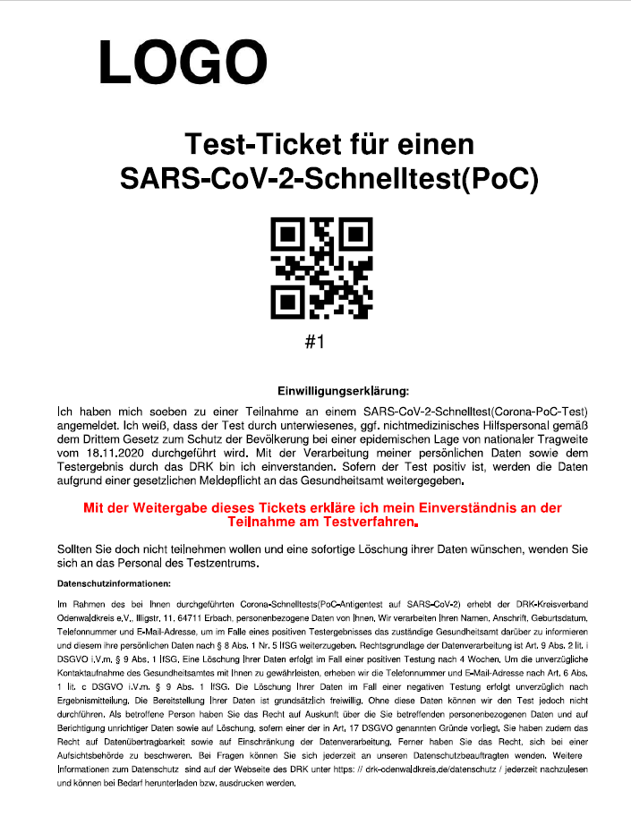

# Testerfassung
Eine Lösung zur Erfassung und Verarbeitung der Testergebnisse in den Testzentren des Odenwaldkreises.

# Komponenten

Das Projekt besteht aus mehreren Teilanwendungen. Vor Ort gibt es ein zwei Endgeräte die im Browser angemeldet sind. Ein Mitarbeiter registriert die Personen die getestet werden möchten.

## NightlyAutoClose

## RenditionJob
Pro Testzentrum gibt es einen Job welcher periodisch über die Datenbank läuft und nach den Testergebnissen bei noch nicht versendeten Einträgen schaut.
Je nach Testergebnis wird an den Empfänger eine Mail aus den Vorlagen gesendet. Hierbei gibt es die Zustände:

1. Testergebnis war positiv
2. Testergebnis war negativ
3. Testergebnis ist nicht eindeutig


## TagesreportPDF
Zur Tagesauswertung für die Gesamtanzal getesteter Personen sowie dem Verhältnis von Positiven und negativen Testergebnissen wird ein Tagesreport erzeugt. Dieser wird automatisiert per Mail jede Nacht versendet und lässt sich im WebUI auch für jeden beliebigen Tag erzeugen.

## CSVExport
Dem Gesundheitsamt wird auf Basis eines täglichen Jobs eine Liste der postive gemeldeten Personen als CSV zur Verfügung gestellt. Die CSV Datei ist gezippt und mit Password versehen. Des Weiteren hat das Gesundheitsamt die Möglichkeit via Login eine Liste aller Infizierten zu erzeugen.

## utils
Hilfsfunktionen wie:

1. Mail senden
2. Schirftarten
3. Mailvorlagen
4. Konfiguration auslesen
5. Datenbank Connector

# Ablaufplan



## Testperson Kommt

## Testauswerteperson trägt Ergebnis ein


# Getting Started

## MySQL Datenbank

Für die Persistierung wird eine MySQL Datenbank verwendet. Diese kann sowohl von einem Dienstleister in einem Rechenzentrum betrieben werden, als auch lokal auf dem Rechner des Terminals laufen. Je nachdem aus welchen Netzwerken Zugang zur Webapplikation benötigt würde, ist dies dementsprechend zu planen.

Für die Verwendung werden aktuelle zwei Tabellen benötigt.
Einmal "Teststation", welche die Metainformationen zu der Teststation enthält.
Darüberhinaus einmal "Vorgang", in welche die Testvorgänge gespeichert werden.

Erzeugt werden können die Tabellen mit folgenden SQL statements:

Vorgang:
```mysql
CREATE TABLE `Vorgang` (
  `id` int(11) NOT NULL,
  `Teststation` int(11) NOT NULL,
  `Token` int(11) NOT NULL,
  `Registrierungszeitpunkt` datetime NOT NULL DEFAULT current_timestamp(),
  `Ergebniszeitpunkt` datetime NOT NULL,
  `Nachname` varchar(100) NOT NULL,
  `Vorname` varchar(100) NOT NULL,
  `Adresse` varchar(150) NOT NULL,
  `Telefon` varchar(15) NOT NULL,
  `Mailadresse` varchar(50) NOT NULL,
  `Geburtsdatum`varchar(20) NOT NULL,
  `Ergebnis` int(11) NOT NULL,
  `Mailsend` tinyint(4) NOT NULL,
  `Updated` timestamp NOT NULL DEFAULT current_timestamp() ON UPDATE current_timestamp()
) ENGINE=InnoDB DEFAULT CHARSET=utf8mb4;

ALTER TABLE `Vorgang`
  ADD UNIQUE KEY `id` (`id`);

ALTER TABLE `Vorgang`
  MODIFY `id` int(11) NOT NULL AUTO_INCREMENT;
COMMIT;
```

Teststation:
```mysql
CREATE TABLE `Teststation` (
  `id` int(11) NOT NULL,
  `Ort` varchar(100) NOT NULL,
  `Updated` timestamp NOT NULL DEFAULT current_timestamp() ON UPDATE current_timestamp()
) ENGINE=InnoDB DEFAULT CHARSET=utf8mb4;

ALTER TABLE `Teststation`
  ADD KEY `id` (`id`);

ALTER TABLE `Teststation`
  MODIFY `id` int(11) NOT NULL AUTO_INCREMENT;
COMMIT;
```

## Webpage
