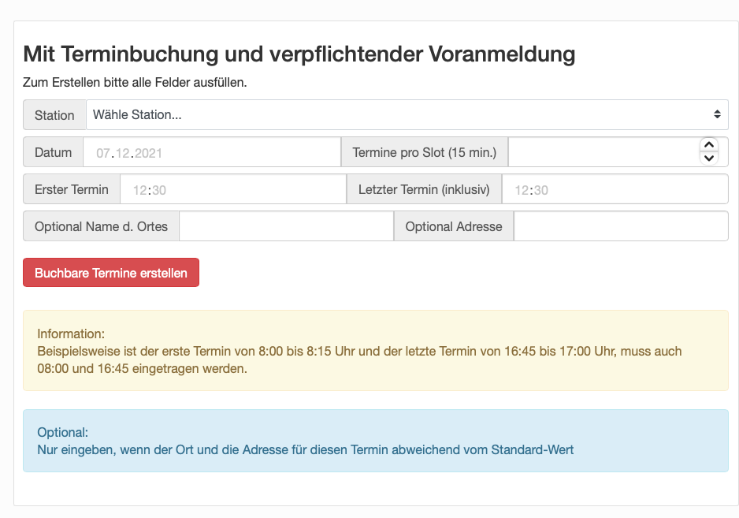

# Testerfassung
Eine Open Source Lösung zur Erfassung und Dokumentation von Corona-Antigen-Schnelltest-Ergebnissen. 

- Online Erfassung von Testergebnissen
- Online Abholung von Testzertifikaten
- CSV Exportfunktion von Testergebnissen für Gesundheitsämter
- Online Terminbuchungen
- Spezialfeatures für Tests in Behinderten- und Pflegeheimen
- Statistiktool
- Automatische Löschung von personenbezogenen Daten
- geplante Anbindung an CWA

Bisher ist die Lösung auf die Erfassung und Verarbeitung der Testergebnisse in den Testzentren des Odenwaldkreises optimiert. Die Komponenten sind jedoch flexibel genug gestaltet, dass auch andere Testzentren damit betrieben werden können. Einzige Vorraussetzung ist ein Server mit LAMP Stack und TSL Zertifikaten


# Frontend

Das Frontend ist in php geschrieben. Aktuelle ist die Testerfassung des Odenwaldkreises hier zu finden:  [Link](https://testzentrum-odw.de/index.php)


Die Website bietet die Möglichkeit verfügbare Termine an mehrere Orten darzustellen und eine geführte Buchung dedizierter Termine durchzuführen.
## Hauptseite

Die Hauptseite ist unterglieder in allgemeine Informationen, z.B. Empfehlungen oder organisatorische Informationen.


## Terminkalender

Herzstück der Seite ist der Terminkalender, welche alle Testmöglichkeiten in einer Tagesansicht bündelt. hier werden freie Termine angezeigt.


## Kapazitätsplanung

Im internen Bereich kann für alle Stationen geplant werden.



Hierbei kann ein Datum, eine optionale Adresse (sofern der Ort z.B. beim mobilen Testen variiert) als auch der Durschsatz (x Tests pro 15 Minuten) angegeben werden. Auf Basis der Einträge werden die Termine dann in der Kalenderansicht angelegt und können gebucht werden.

## Terminbuchung

Freie Termine sind in der Kalenderansicht klickbar. Sobald alle Termine ausgebucht sind wird dies ebenfalls angezeigt.


Beim Auswählen des Tages der jeweiligen Statione werden alle verfügbaren Termine angezeigt.


Hierbei sind neben allgemeinen Ablaufinformationen auch die verfügbaren Slots wählbar.

In der Anmeldemaske werden nun alle relavanten Informationen der Person abgefragt.


Nach der Registrierung wird eine Mail zur Verifizierung versendet, welche bestätigt werden muss. Nach erfolgter Verifizierung wird der Termin bestätigt und ist gebucht.

Bei der Anmeldung kann ebenfalls entschieden werden, ob die CWA App verwendet werde soll. Der QR Code zum Abscannen wird vor Ort zur Verfügung gestellt.


Am Tag des Tests wird nochmals via Mail auf den Termin erinnert. In der Mail besteht die Möglichkeit den Termin zu stornieren.


## Terminbuchung Intern

Terminkontigente lassen sich mittels Passwort versehen, so dass diese z.B. nur für bestimmte Einrichtungen oder Unternehmen verwendet werden können. Auch kann dies z.B. von einer Hotline dazu verwendet werden Termine mit separatem Kontigent via Telefonanzubieten. Eine Mailadresse ist für interne Terminvergaben nicht verpflichtend. Hierbei entfällt dann der E-Mail Verifikationsschritt. Der Termin wird direkt gebucht.

## Voranmeldung

Im internen Bereich können die Voranmeldungen pro Tag eingesehen werden.


Die Anmeldung können hier sortiert und auch gefiltert werden. Darüber hinaus lassen sich Einträge löschen oder verändern. Auch kann hier angegeben werden, sobald die Person erschienen ist.

Die Liste lässt sich exportieren und wird als .xlsx zum Download zur Verfügung gestellt.


# Backend

## Cleaner
Sofern bei der Registrierung keine korrekte Mail angegeben wurde wird der Termin wieder freigegeben. Hierbei muss sowohl der Eintrag in der verif Tabelle gelöscht, als auch die Voranmeldung entfernt und der Termineintrag auf Unused gesetzt werden. Der Cleaner übernimmt diese Aufgabe und wird idealerweise im cron alle 30 Minuten ausgeführt.

## NightlyAutoClean

Alle erzeugten Codes werden vorab in einer Datenbank gespeichert. Sobald der Code bei einer Registrierung verwendet wird, wird dies in der Tabelle Kartennummern vermerkt.
Diese verwendeten Nummern werden in der Nacht zum Sonntag gelöscht.

## RenditionJob
Pro Testzentrum gibt es einen Job welcher periodisch über die Datenbank läuft und nach den Testergebnissen bei noch nicht versendeten Einträgen schaut.
Je nach Testergebnis wird an den Empfänger eine Mail aus den Vorlagen gesendet. Hierbei gibt es die Zustände:

1. Testergebnis war positiv
2. Testergebnis war negativ
3. Testergebnis ist nicht eindeutig

Der Renidition Job wird pro Station gestartet um die Last zu verteilen. Hierbei wird die Station als Parameter eingefügt:

```python
python job.py STATION-ID
```

Im cron sieht der Befehl folgendermaßen aus um für viele Stationen im Intervall von 5 Minuten aber unterschiedlichen Startzeitpunkten den job zu triggern:

```shell
1-59/5 * * * * cd /home/webservice/Testerfassung/RenditionJob && python3 job.py 1
2-59/5 * * * * cd /home/webservice/Testerfassung/RenditionJob && python3 job.py 1
```

## TagesreportPDF
Zur Tagesauswertung für die Gesamtanzal getesteter Personen sowie dem Verhältnis von Positiven und negativen Testergebnissen wird ein Tagesreport erzeugt. Dieser wird automatisiert per Mail jede Nacht versendet und lässt sich im WebUI auch für jeden beliebigen Tag erzeugen.

```python
python job.py DATUM
```

Die Tagesreports werden in ../../Reports Directory abgelegt. Dieses muss angelegt sein.
Der Tagesreport erzeugt ein Kuchendiagramm aus der Tagesstatistik.


Mittels dem Parameter SEND kann das Tagesprotokoll auch verschickt werden. Die Adressen sind hierbei in der sendmail methode eingetragen.

```python
python job.py DATUM True
```

## CSVExport
Dem Gesundheitsamt wird auf Basis eines täglichen Jobs eine Liste der postive gemeldeten Personen als CSV zur Verfügung gestellt. Die CSV Datei ist gezippt und mit Password versehen. Des Weiteren hat das Gesundheitsamt die Möglichkeit via Login eine Liste aller Infizierten zu erzeugen.

```python
python job.py DATUM
```

Die Exports werden in ../../Reports Directory abgelegt. Dieses muss angelegt sein.

Mittels dem Parameter SEND kann das Tagesprotokoll auch verschickt werden. Die Adressen sind hierbei in der sendmail methode eingetragen.

```python
python job.py DATUM True
```

## QRGeneration
Die Laufkarten werden mit einem einmaligen QR Code versehen welcher über dieses Modul erzeugt werden kann. Die erzeugten Codes müssen vorab in der Datenbank angeöegt werden.

```python
python job.py ANZAHL
```

Die Laufkarten werden in ../../Testkarten Directory abgelegt. Dieses muss angelegt sein.

## utils
Hilfsfunktionen wie:

1. Mail senden
2. Schirftarten
3. Mailvorlagen
4. Konfiguration auslesen
5. Datenbank Connector

# Ablaufplan


## MySQL Datenbank

Für die Persistierung wird eine MySQL Datenbank verwendet. Diese kann sowohl von einem Dienstleister in einem Rechenzentrum betrieben werden, als auch lokal auf dem Rechner des Terminals laufen. Je nachdem aus welchen Netzwerken Zugang zur Webapplikation benötigt würde, ist dies dementsprechend zu planen.

Für die Verwendung werden aktuelle zwei Tabellen benötigt.
Einmal "Teststation", welche die Metainformationen zu der Teststation enthält.
Darüberhinaus einmal "Vorgang", in welche die Testvorgänge gespeichert werden.

Erzeugt werden können die Tabellen mit folgenden SQL statements:

### Station

```mysql
CREATE TABLE `Station` (
  `id` int(11) NOT NULL,
  `Ort` varchar(100) NOT NULL,
  `Adresse` varchar(100) NOT NULL,
  `Firmencode` varchar(32) DEFAULT NULL,
  `Oeffnungszeiten` varchar(100) DEFAULT NULL,
  `Testtyp_id` int(11) NOT NULL DEFAULT 1,
  `Updated` timestamp NOT NULL DEFAULT current_timestamp() ON UPDATE current_timestamp()
) ENGINE=InnoDB DEFAULT CHARSET=utf8mb4;
```

### Termine

```mysql
CREATE TABLE `Termine` (
  `id` int(11) NOT NULL,
  `id_station` int(11) NOT NULL,
  `opt_station` varchar(36) DEFAULT NULL,
  `opt_station_adresse` varchar(64) DEFAULT NULL,
  `Tag` date DEFAULT NULL,
  `Stunde` int(2) DEFAULT NULL,
  `Slot` int(2) DEFAULT NULL,
  `Used` tinyint(1) DEFAULT NULL,
  `Startzeit` datetime DEFAULT NULL,
  `Endzeit` datetime DEFAULT NULL,
  `Updated` timestamp NOT NULL DEFAULT current_timestamp() ON UPDATE current_timestamp()
) ENGINE=InnoDB DEFAULT CHARSET=utf8mb4;
```

### Voranmeldung

```mysql
CREATE TABLE `Voranmeldung` (
  `id` int(11) NOT NULL,
  `Token` varchar(40) DEFAULT NULL,
  `Mailsend` tinyint(4) NOT NULL DEFAULT 0,
  `Anmeldezeitpunkt` datetime NOT NULL DEFAULT current_timestamp(),
  `Vorname` varchar(40) NOT NULL,
  `Nachname` varchar(100) NOT NULL,
  `Wohnort` varchar(150) NOT NULL,
  `Adresse` varchar(150) NOT NULL,
  `Telefon` varchar(50) DEFAULT NULL,
  `Mailadresse` varchar(50) NOT NULL,
  `Geburtsdatum` varchar(25) NOT NULL,
  `Tag` date NOT NULL,
  `Termin_id` int(11) DEFAULT NULL,
  `Used` int(11) NOT NULL DEFAULT 0,
  `Reminded` tinyint(4) NOT NULL DEFAULT 0,
  `zip_request` tinyint(1) NOT NULL DEFAULT 0,
  `CWA_request` int(1) NOT NULL DEFAULT 0 COMMENT '1=Personalisiert;2=Anonymisiert',
  `PCR_Grund` int(11) DEFAULT NULL,
  `Updated` timestamp NOT NULL DEFAULT current_timestamp() ON UPDATE current_timestamp()
) ENGINE=InnoDB DEFAULT CHARSET=utf8mb4;
```

### Vorgang

```mysql
CREATE TABLE `Vorgang` (
  `id` int(11) NOT NULL,
  `Teststation` int(11) DEFAULT NULL,
  `Token` varchar(8) NOT NULL,
  `Registrierungszeitpunkt` datetime NOT NULL DEFAULT current_timestamp(),
  `reg_type` text DEFAULT NULL,
  `Ergebniszeitpunkt` datetime DEFAULT NULL,
  `Nachname` varchar(100) NOT NULL,
  `Vorname` varchar(100) NOT NULL,
  `Wohnort` varchar(150) DEFAULT NULL,
  `Adresse` varchar(150) DEFAULT NULL,
  `Telefon` varchar(50) DEFAULT NULL,
  `Mailadresse` varchar(50) DEFAULT NULL,
  `Geburtsdatum` varchar(25) DEFAULT NULL,
  `Ergebnis` int(3) DEFAULT 5,
  `Customer_key` text DEFAULT NULL,
  `customer_lock` int(3) DEFAULT NULL,
  `privateMail_lock` int(3) DEFAULT NULL,
  `gaMail_lock` int(3) DEFAULT NULL,
  `CWA_lock` int(3) DEFAULT NULL,
  `zip_lock` int(3) DEFAULT NULL,
  `privateMail_request` tinyint(1) NOT NULL DEFAULT 0,
  `handout_request` tinyint(1) NOT NULL DEFAULT 0,
  `CWA_request` int(1) NOT NULL DEFAULT 0 COMMENT '	1=Personalisiert;2=Anonymisiert	',
  `zip_request` tinyint(1) NOT NULL DEFAULT 0,
  `salt` varchar(250) DEFAULT NULL,
  `Testtyp_id` int(11) DEFAULT 1,
  `PCR_Grund` int(11) DEFAULT NULL,
  `Updated` timestamp NOT NULL DEFAULT current_timestamp() ON UPDATE current_timestamp()
) ENGINE=InnoDB DEFAULT CHARSET=utf8mb4;
```